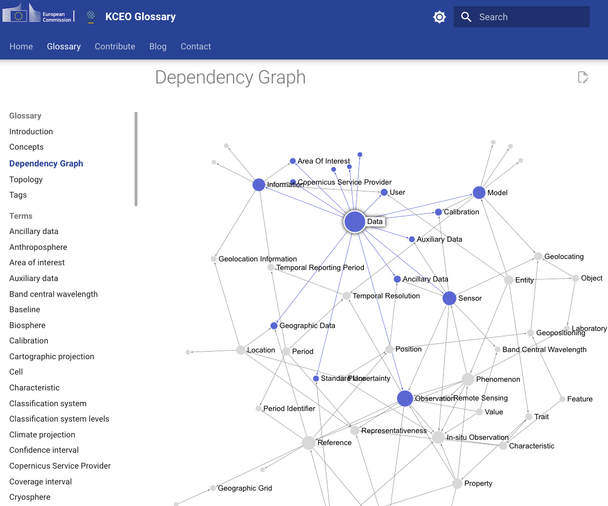

# Sigma-JS Graph Update

We replaced the old, static legacy graph based on mermaid and added an interactive graph based on sigma-js here:

- [Dependency Graph](https://ec-jrc.github.io/KCEO-Glossary/sigmajs/)

You can now explore the graph interactively and highlight each term's connections. We will soon add a filter function as well so you can query the graph without leaving the website.

The old mermaid graph is available on the same site.
