  <button id="fullscreen-btn">Fullscreen</button>
  <button id="zoom-reset-btn">Reset Zoom</button>

  <input type="text" id="node-filter-input" placeholder="Filter nodes by label">

---

## Legacy Mermaid Graph 

```mermaid
flowchart TD;
    id_geopositioning(["<a href='../geopositioning'>Geopositioning</a>"]) --> id_geolocating(["<a href='../geolocating'>Geolocating</a>"]);
    id_object(["<a href='../object'>Object</a>"]) --> id_geolocating(["<a href='../geolocating'>Geolocating</a>"]);
    id_object(["<a href='../object'>Object</a>"]) --> id_laboratory_observation(["<a href='../laboratory_observation'>Laboratory Observation</a>"]);
    id_sensor(["<a href='../sensor'>Sensor</a>"]) --> id_observation(["<a href='../observation'>Observation</a>"]);
    id_sensor(["<a href='../sensor'>Sensor</a>"]) --> id_auxiliary_data(["<a href='../auxiliary_data'>Auxiliary Data</a>"]);
    id_sensor(["<a href='../sensor'>Sensor</a>"]) --> id_band_central_wavelength(["<a href='../band_central_wavelength'>Band Central Wavelength</a>"]);
    id_sensor(["<a href='../sensor'>Sensor</a>"]) --> id_calibration(["<a href='../calibration'>Calibration</a>"]);
    id_sensor(["<a href='../sensor'>Sensor</a>"]) --> id_geolocating(["<a href='../geolocating'>Geolocating</a>"]);
    id_sensor(["<a href='../sensor'>Sensor</a>"]) --> id_in-situ_observation(["<a href='../in-situ_observation'>In-situ Observation</a>"]);
    id_sensor(["<a href='../sensor'>Sensor</a>"]) --> id_ancillary_data(["<a href='../ancillary_data'>Ancillary Data</a>"]);
    id_model(["<a href='../model'>Model</a>"]) --> id_vertical_levels(["<a href='../vertical_levels'>Vertical Levels</a>"]);
    id_model(["<a href='../model'>Model</a>"]) --> id_time_of_day(["<a href='../time_of_day'>Time Of Day</a>"]);
    id_model(["<a href='../model'>Model</a>"]) --> id_calibration(["<a href='../calibration'>Calibration</a>"]);
    id_model(["<a href='../model'>Model</a>"]) --> id_temporal_resolution(["<a href='../temporal_resolution'>Temporal Resolution</a>"]);
    id_model(["<a href='../model'>Model</a>"]) --> id_geolocating(["<a href='../geolocating'>Geolocating</a>"]);
    id_model(["<a href='../model'>Model</a>"]) --> id_time_of_year(["<a href='../time_of_year'>Time Of Year</a>"]);
    id_data(["<a href='../data'>Data</a>"]) --> id_information(["<a href='../information'>Information</a>"]);
    id_data(["<a href='../data'>Data</a>"]) --> id_user(["<a href='../user'>User</a>"]);
    id_data(["<a href='../data'>Data</a>"]) --> id_validation(["<a href='../validation'>Validation</a>"]);
    id_data(["<a href='../data'>Data</a>"]) --> id_auxiliary_data(["<a href='../auxiliary_data'>Auxiliary Data</a>"]);
    id_data(["<a href='../data'>Data</a>"]) --> id_observation(["<a href='../observation'>Observation</a>"]);
    id_data(["<a href='../data'>Data</a>"]) --> id_replicability(["<a href='../replicability'>Replicability</a>"]);
    id_data(["<a href='../data'>Data</a>"]) --> id_geographic_data(["<a href='../geographic_data'>Geographic Data</a>"]);
    id_data(["<a href='../data'>Data</a>"]) --> id_calibration(["<a href='../calibration'>Calibration</a>"]);
    id_data(["<a href='../data'>Data</a>"]) --> id_area_of_interest(["<a href='../area_of_interest'>Area Of Interest</a>"]);
    id_data(["<a href='../data'>Data</a>"]) --> id_copernicus_service_provider(["<a href='../copernicus_service_provider'>Copernicus Service Provider</a>"]);
    id_data(["<a href='../data'>Data</a>"]) --> id_standard_uncertainty(["<a href='../standard_uncertainty'>Standard Uncertainty</a>"]);
    id_data(["<a href='../data'>Data</a>"]) --> id_sensor(["<a href='../sensor'>Sensor</a>"]);
    id_data(["<a href='../data'>Data</a>"]) --> id_model(["<a href='../model'>Model</a>"]);
    id_data(["<a href='../data'>Data</a>"]) --> id_reproducibility(["<a href='../reproducibility'>Reproducibility</a>"]);
    id_data(["<a href='../data'>Data</a>"]) --> id_ancillary_data(["<a href='../ancillary_data'>Ancillary Data</a>"]);
    id_place(["<a href='../place'>Place</a>"]) --> id_position(["<a href='../position'>Position</a>"]);
    id_place(["<a href='../place'>Place</a>"]) --> id_location(["<a href='../location'>Location</a>"]);
    id_place(["<a href='../place'>Place</a>"]) --> id_in-situ_observation(["<a href='../in-situ_observation'>In-situ Observation</a>"]);
    id_reference(["<a href='../reference'>Reference</a>"]) --> id_position(["<a href='../position'>Position</a>"]);
    id_reference(["<a href='../reference'>Reference</a>"]) --> id_geographic_data(["<a href='../geographic_data'>Geographic Data</a>"]);
    id_reference(["<a href='../reference'>Reference</a>"]) --> id_geographic_grid(["<a href='../geographic_grid'>Geographic Grid</a>"]);
    id_reference(["<a href='../reference'>Reference</a>"]) --> id_period_identifier(["<a href='../period_identifier'>Period Identifier</a>"]);
    id_reference(["<a href='../reference'>Reference</a>"]) --> id_traceability(["<a href='../traceability'>Traceability</a>"]);
    id_reference(["<a href='../reference'>Reference</a>"]) --> id_geographic_coordinate_reference_system(["<a href='../geographic_coordinate_reference_system'>Geographic Coordinate Reference System</a>"]);
    id_phenomenon(["<a href='../phenomenon'>Phenomenon</a>"]) --> id_observation(["<a href='../observation'>Observation</a>"]);
    id_phenomenon(["<a href='../phenomenon'>Phenomenon</a>"]) --> id_reference(["<a href='../reference'>Reference</a>"]);
    id_phenomenon(["<a href='../phenomenon'>Phenomenon</a>"]) --> id_laboratory_observation(["<a href='../laboratory_observation'>Laboratory Observation</a>"]);
    id_phenomenon(["<a href='../phenomenon'>Phenomenon</a>"]) --> id_remote_sensing(["<a href='../remote_sensing'>Remote Sensing</a>"]);
    id_phenomenon(["<a href='../phenomenon'>Phenomenon</a>"]) --> id_sensor(["<a href='../sensor'>Sensor</a>"]);
    id_phenomenon(["<a href='../phenomenon'>Phenomenon</a>"]) --> id_in-situ_observation(["<a href='../in-situ_observation'>In-situ Observation</a>"]);
    id_uncertainty(["<a href='../uncertainty'>Uncertainty</a>"]) --> id_reference(["<a href='../reference'>Reference</a>"]);
    id_uncertainty(["<a href='../uncertainty'>Uncertainty</a>"]) --> id_standard_uncertainty(["<a href='../standard_uncertainty'>Standard Uncertainty</a>"]);
    id_uncertainty(["<a href='../uncertainty'>Uncertainty</a>"]) --> id_thematic_uncertainty(["<a href='../thematic_uncertainty'>Thematic Uncertainty</a>"]);
    id_uncertainty(["<a href='../uncertainty'>Uncertainty</a>"]) --> id_in-situ_observation(["<a href='../in-situ_observation'>In-situ Observation</a>"]);
    id_uncertainty(["<a href='../uncertainty'>Uncertainty</a>"]) --> id_expanded_uncertainty(["<a href='../expanded_uncertainty'>Expanded Uncertainty</a>"]);
    id_uncertainty(["<a href='../uncertainty'>Uncertainty</a>"]) --> id_traceability(["<a href='../traceability'>Traceability</a>"]);
    id_observation(["<a href='../observation'>Observation</a>"]) --> id_reference(["<a href='../reference'>Reference</a>"]);
    id_observation(["<a href='../observation'>Observation</a>"]) --> id_measurement(["<a href='../measurement'>Measurement</a>"]);
    id_observation(["<a href='../observation'>Observation</a>"]) --> id_temporal_resolution(["<a href='../temporal_resolution'>Temporal Resolution</a>"]);
    id_observation(["<a href='../observation'>Observation</a>"]) --> id_remote_sensing(["<a href='../remote_sensing'>Remote Sensing</a>"]);
    id_observation(["<a href='../observation'>Observation</a>"]) --> id_in-situ_observation(["<a href='../in-situ_observation'>In-situ Observation</a>"]);
    id_observation(["<a href='../observation'>Observation</a>"]) --> id_representativeness(["<a href='../representativeness'>Representativeness</a>"]);
    id_grid(["<a href='../grid'>Grid</a>"]) --> id_geographic_grid(["<a href='../geographic_grid'>Geographic Grid</a>"]);
    id_entity(["<a href='../entity'>Entity</a>"]) --> id_trait(["<a href='../trait'>Trait</a>"]);
    id_entity(["<a href='../entity'>Entity</a>"]) --> id_user(["<a href='../user'>User</a>"]);
    id_entity(["<a href='../entity'>Entity</a>"]) --> id_object(["<a href='../object'>Object</a>"]);
    id_entity(["<a href='../entity'>Entity</a>"]) --> id_model(["<a href='../model'>Model</a>"]);
    id_entity(["<a href='../entity'>Entity</a>"]) --> id_phenomenon(["<a href='../phenomenon'>Phenomenon</a>"]);
    id_measurement(["<a href='../measurement'>Measurement</a>"]) --> id_representativeness(["<a href='../representativeness'>Representativeness</a>"]);
    id_measurement(["<a href='../measurement'>Measurement</a>"]) --> id_measurand(["<a href='../measurand'>Measurand</a>"]);
    id_measurement(["<a href='../measurement'>Measurement</a>"]) --> id_traceability(["<a href='../traceability'>Traceability</a>"]);
    id_measurement(["<a href='../measurement'>Measurement</a>"]) --> id_uncertainty(["<a href='../uncertainty'>Uncertainty</a>"]);
    id_measurand(["<a href='../measurand'>Measurand</a>"]) --> id_uncertainty(["<a href='../uncertainty'>Uncertainty</a>"]);
    id_location(["<a href='../location'>Location</a>"]) --> id_geocoding(["<a href='../geocoding'>Geocoding</a>"]);
    id_location(["<a href='../location'>Location</a>"]) --> id_geolocation_information(["<a href='../geolocation_information'>Geolocation Information</a>"]);
    id_location(["<a href='../location'>Location</a>"]) --> id_representativeness(["<a href='../representativeness'>Representativeness</a>"]);
    id_location(["<a href='../location'>Location</a>"]) --> id_geographic_data(["<a href='../geographic_data'>Geographic Data</a>"]);
    id_value(["<a href='../value'>Value</a>"]) --> id_observation(["<a href='../observation'>Observation</a>"]);
    id_value(["<a href='../value'>Value</a>"]) --> id_band_central_wavelength(["<a href='../band_central_wavelength'>Band Central Wavelength</a>"]);
    id_value(["<a href='../value'>Value</a>"]) --> id_in-situ_observation(["<a href='../in-situ_observation'>In-situ Observation</a>"]);
    id_information(["<a href='../information'>Information</a>"]) --> id_classification_system(["<a href='../classification_system'>Classification System</a>"]);
    id_information(["<a href='../information'>Information</a>"]) --> id_user(["<a href='../user'>User</a>"]);
    id_information(["<a href='../information'>Information</a>"]) --> id_geolocation_information(["<a href='../geolocation_information'>Geolocation Information</a>"]);
    id_information(["<a href='../information'>Information</a>"]) --> id_temporal_reporting_period(["<a href='../temporal_reporting_period'>Temporal Reporting Period</a>"]);
    id_information(["<a href='../information'>Information</a>"]) --> id_area_of_interest(["<a href='../area_of_interest'>Area Of Interest</a>"]);
    id_information(["<a href='../information'>Information</a>"]) --> id_copernicus_service_provider(["<a href='../copernicus_service_provider'>Copernicus Service Provider</a>"]);
    id_information(["<a href='../information'>Information</a>"]) --> id_thematic_resolution(["<a href='../thematic_resolution'>Thematic Resolution</a>"]);
    id_period(["<a href='../period'>Period</a>"]) --> id_temporal_reporting_period(["<a href='../temporal_reporting_period'>Temporal Reporting Period</a>"]);
    id_period(["<a href='../period'>Period</a>"]) --> id_representativeness(["<a href='../representativeness'>Representativeness</a>"]);
    id_period(["<a href='../period'>Period</a>"]) --> id_period_identifier(["<a href='../period_identifier'>Period Identifier</a>"]);
    id_period(["<a href='../period'>Period</a>"]) --> id_temporal_resolution(["<a href='../temporal_resolution'>Temporal Resolution</a>"]);
    id_temporal_resolution(["<a href='../temporal_resolution'>Temporal resolution</a>"]) --> id_temporal_reporting_period(["<a href='../temporal_reporting_period'>Temporal Reporting Period</a>"]);
    id_property(["<a href='../property'>Property</a>"]) --> id_observation(["<a href='../observation'>Observation</a>"]);
    id_property(["<a href='../property'>Property</a>"]) --> id_quantity(["<a href='../quantity'>Quantity</a>"]);
    id_property(["<a href='../property'>Property</a>"]) --> id_in-situ_observation(["<a href='../in-situ_observation'>In-situ Observation</a>"]);
    id_property(["<a href='../property'>Property</a>"]) --> id_phenomenon(["<a href='../phenomenon'>Phenomenon</a>"]);
    id_property(["<a href='../property'>Property</a>"]) --> id_traceability(["<a href='../traceability'>Traceability</a>"]);
    id_sample(["<a href='../sample'>Sample</a>"]) --> id_temporal_consistency(["<a href='../temporal_consistency'>Temporal Consistency</a>"]);
    id_trait(["<a href='../trait'>Trait</a>"]) --> id_property(["<a href='../property'>Property</a>"]);
    id_quantity(["<a href='../quantity'>Quantity</a>"]) --> id_duration(["<a href='../duration'>Duration</a>"]);
    id_quantity(["<a href='../quantity'>Quantity</a>"]) --> id_measurand(["<a href='../measurand'>Measurand</a>"]);
    id_quantity(["<a href='../quantity'>Quantity</a>"]) --> id_measurement(["<a href='../measurement'>Measurement</a>"]);
    id_confidence_interval(["<a href='../confidence_interval'>Confidence interval</a>"]) --> id_expanded_uncertainty(["<a href='../expanded_uncertainty'>Expanded Uncertainty</a>"]);
    id_position(["<a href='../position'>Position</a>"]) --> id_geopositioning(["<a href='../geopositioning'>Geopositioning</a>"]);
    id_position(["<a href='../position'>Position</a>"]) --> id_ancillary_data(["<a href='../ancillary_data'>Ancillary Data</a>"]);
    id_characteristic(["<a href='../characteristic'>Characteristic</a>"]) --> id_trait(["<a href='../trait'>Trait</a>"]);
    id_characteristic(["<a href='../characteristic'>Characteristic</a>"]) --> id_representativeness(["<a href='../representativeness'>Representativeness</a>"]);
    id_characteristic(["<a href='../characteristic'>Characteristic</a>"]) --> id_in-situ_observation(["<a href='../in-situ_observation'>In-situ Observation</a>"]);
    id_feature(["<a href='../feature'>Feature</a>"]) --> id_geopositioning(["<a href='../geopositioning'>Geopositioning</a>"]);
    id_feature(["<a href='../feature'>Feature</a>"]) --> id_characteristic(["<a href='../characteristic'>Characteristic</a>"]);
```

  
Legacy Mermaid Graph

